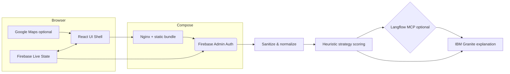

# PitMind — AI Race Strategy & Explainability Copilot

PitMind is a demo-grade full-stack assistant for Formula 1-style race engineers. It ingests lap telemetry, scores pit-stop urgency with transparent heuristics, optionally merges Langflow orchestration signals over HTTP, and asks **IBM Granite** (via Watsonx.ai or Replicate-compatible endpoints) to narrate the recommendation in plain language engineers can trust under pressure.

Detailed breakdown lives in [`docs/architecture.md`](./docs/architecture.md).

## Problem

Race engineers synthesize hundreds of telemetry-derived signals per lap—tyre degradation, fuel loads, gaps, sector deltas, weather volatility—while the clock is merciless. Tools that output opaque scores burn trust; explainability is not polish, it is operational safety.

## AI / Technical Approach

- **IBM Granite** powers natural-language explanations for strategy cards, comparison summaries, debriefs, and interactive chat follow-ups (`backend/app/services/granite.py`).
- **Langflow** models the multi-step pipeline visually. This repo ships a blueprint export in `langflow-flows/pitmind_strategy_pipeline.json` plus an HTTP runner stub (`backend/app/services/langflow_client.py`) so flows can call external enrichment endpoints before Granite narrates.
- **FastAPI** validates uploads, rate limits APIs, sanitizes paths, and stitches pipeline stages. The backend is modularized into `routes/`, `models/` (Pydantic), and `services/`.
- **FastF1** (optional) produces grounded CSV exports via `backend/scripts/export_fastf1_sample.py`; bundled samples live in `data/`.
- **React + Tailwind + Recharts + React Router** drive the multi-view frontend (Dashboard for engineers, Fan Mode for public).
- **Google Maps JavaScript API** renders circuit anchors when `VITE_GOOGLE_MAPS_API_KEY` is configured.
- **Firebase Realtime Database & Auth** manages the live race state (`useFirebaseRaceState.ts`) and Google OAuth for engineer routing (`routes/auth.py` via `firebase-admin`).
- **Google Analytics** hooks load when `VITE_GA_MEASUREMENT_ID` is present (`frontend/src/main.tsx`).
- **Docling** (optional dependency) parses PDF uploads for post-race debrief grounding.

## Why Explainability Matters

An engineer under SC/VSC pressure needs to defend every call on the pit wall. Granite-backed rationales tie quantitative triggers—wear proxies, lap-time trends, gap volatility—to prose so humans can agree, override, or annotate quickly without reverse-engineering a black box.

## Screenshots & Demo Assets

Drop GIFs or PNGs into `docs/screenshots/` and reference them here after capturing your local demo (`docker-compose up --build`).

## Repository Layout

```
pitMind/
├── frontend        # React (Vite) UI + Tailwind + Firebase Hooks
├── backend         # FastAPI (routes/, models/, services/) + Granite/Langflow clients
├── langflow-flows  # Exported / blueprint Langflow JSON
├── data            # Sample telemetry CSV (FastF1-inspired columns)
├── docs            # Architecture notes & screenshot staging
└── docker-compose.yml
```

## Architecture Diagram



## Security Notes

- Secrets stay in `.env` (copy from `.env.example`). Nothing sensitive ships in git.
- Upload endpoints enforce byte caps (`sanitize.MAX_UPLOAD_BYTES`, debrief cap in `main.py`).
- SlowAPI rate limits guard `/api/v1/*`.
- CORS allow-list configured via `BACKEND_CORS_ORIGINS`.

## Getting Started

### Prerequisites

- Docker / Docker Compose **or** Python 3.12 + Node 20
- API keys as needed: Watsonx **or** Replicate for Granite, optional Langflow API URL, Google Maps key, Firebase web credentials, GA measurement ID

### Docker Compose (preferred)

```bash
cp .env.example .env
# Populate Granite + optional integrations
docker compose up --build
```

- UI proxied through nginx at `http://localhost:8080` (`/api` forwarded to FastAPI).
- FastAPI also exposed directly at `http://localhost:8000` for debugging.

### Local Development

Backend:

```bash
cd backend
# Note: Python 3.11 or 3.12 is required (pydantic-core requires Rust/maturin on 3.14+)
# A .python-version file is included for pyenv users.
python -m venv .venv
source .venv/bin/activate  # Windows: .venv\Scripts\activate
pip install -r requirements.txt
uvicorn app.main:app --reload --port 8000
```

Frontend:

```bash
cd frontend
npm install
npm run dev -- --host 127.0.0.1 --port 5173
```

Set `VITE_API_BASE_URL=http://localhost:8000` for direct FastAPI access while using Vite's dev server.

### Tests & Linting

```bash
cd backend && pytest
cd frontend && npm run test && npm run lint
```

Vitest covers lightweight UI utilities; pytest guards strategy scoring invariants.

### Generate CSV via FastF1

```bash
pip install fastf1 pandas
python backend/scripts/export_fastf1_sample.py
```

## Accessibility Checklist (implemented patterns)

- Skip navigation link, tab roles for primary navigation, keyboard-focus outlines (`frontend/src/App.tsx`, `frontend/src/index.css`).
- Charts paired with concise HTML tables as textual alternatives (`TelemetryCharts.tsx`, `CompareTelemetryChart.tsx`).
- Dark palette tuned for high contrast (#f4f4f5 on #0a0a0b with accent #e10600).

## License

Provided as an educational reference implementation. Verify telemetry licensing (FastF1/Ergast) before redistributing derived datasets.
