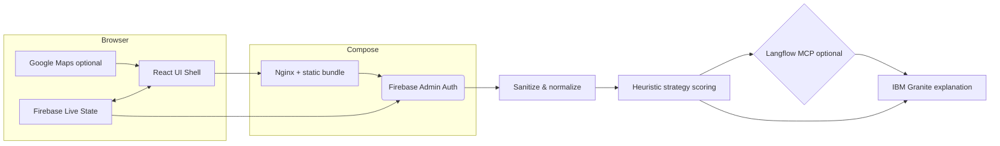

# PitMind — AI Race Strategy & Explainability Copilot

PitMind is a demo-grade full-stack assistant for Formula 1-style race engineers. It ingests lap telemetry, scores pit-stop urgency with transparent heuristics, optionally merges Langflow orchestration signals over HTTP, and asks **IBM Granite** (via Watsonx.ai or Replicate-compatible endpoints) to narrate the recommendation in plain language engineers can trust under pressure.

The interface is styled with the official **Formula 1 design language**—featuring signature F1 red (`#EF3340`), bold Outfit typography, premium animations, and data-focused layouts that communicate speed and precision.

Detailed breakdown lives in [`docs/architecture.md`](./docs/architecture.md). For design details, see [`docs/F1_STYLING.md`](./docs/F1_STYLING.md).

## Problem

Race engineers synthesize hundreds of telemetry-derived signals per lap—tyre degradation, fuel loads, gaps, sector deltas, weather volatility—while the clock is merciless. Tools that output opaque scores burn trust; explainability is not polish, it is operational safety.

## AI / Technical Approach

- **IBM Granite** powers natural-language explanations for strategy cards, comparison summaries, debriefs, and interactive chat follow-ups (`backend/services/granite.py`).
- **Langflow** models the multi-step pipeline visually. This repo ships a blueprint export in `langflow-flows/pitmind_strategy_pipeline.json` plus an HTTP runner stub (`backend/services/langflow_client.py`) so flows can call external enrichment endpoints before Granite narrates.
- **FastAPI** validates uploads, rate limits APIs, sanitizes paths, and stitches pipeline stages. The backend is modularized into `routes/`, `models/` (Pydantic), and `services/`.
- **FastF1** (optional) produces grounded CSV exports via `backend/scripts/export_fastf1_sample.py`; bundled samples live in `data/`.
- **React + Tailwind + Recharts + React Router** drive the multi-view frontend (Dashboard for engineers, Fan Mode for public).
- **Google Maps JavaScript API** renders circuit anchors when `VITE_GOOGLE_MAPS_API_KEY` is configured.
- **Firebase Realtime Database & Auth** manages the live race state (`useFirebaseRaceState.ts`) and Google OAuth for engineer routing (`routes/auth.py` via `firebase-admin`).
- **Google Analytics** hooks load when `VITE_GA_MEASUREMENT_ID` is present (`frontend/src/main.tsx`).
- **Docling** (optional dependency) parses PDF uploads for post-race debrief grounding.

## Why Explainability Matters

An engineer under SC/VSC pressure needs to defend every call on the pit wall. Granite-backed rationales tie quantitative triggers—wear proxies, lap-time trends, gap volatility—to prose so humans can agree, override, or annotate quickly without reverse-engineering a black box.

## Screenshots & Demo Assets

Drop GIFs or PNGs into `docs/screenshots/` and reference them here after capturing your local demo (`docker-compose up --build`).

## Repository Layout

```
pitMind/
├── frontend        # React (Vite) UI + Tailwind + Firebase Hooks
├── backend         # FastAPI (routes/, models/, services/) + Granite/Langflow clients
├── langflow-flows  # Exported / blueprint Langflow JSON
├── data            # Sample telemetry CSV (FastF1-inspired columns)
├── docs            # Architecture notes & screenshot staging
└── docker-compose.yml
```

## Architecture Diagram



## Security Notes

- Secrets stay in `.env` (copy from `.env.example`). Nothing sensitive ships in git.
- Upload endpoints enforce byte caps (`sanitize.MAX_UPLOAD_BYTES`, debrief cap in `main.py`).
- SlowAPI rate limits guard `/api/v1/*`.
- CORS allow-list configured via `BACKEND_CORS_ORIGINS`.

## Getting Started

### Prerequisites

- Docker / Docker Compose **or** Python 3.12 + Node 20
- API keys as needed: Watsonx **or** Replicate for Granite, optional Langflow API URL, Google Maps key, Firebase web credentials, GA measurement ID
- For Watsonx, set **all three** backend env vars: `WATSONX_API_KEY`, `WATSONX_PROJECT_ID`, and `WATSONX_URL` (for example `https://us-south.ml.cloud.ibm.com`).
- If chat still falls back, open `GET /health` and check `missing_requirements` in the JSON response.

### Docker Compose (preferred)

```bash
cp .env.example .env
# Populate Granite + optional integrations
docker compose up --build
```

- UI proxied through nginx at `http://localhost:8080` (`/api` forwarded to FastAPI).
- FastAPI also exposed directly at `http://localhost:8000` for debugging.

### Local Development

Backend:

```bash
cd backend
# Note: Python 3.11 or 3.12 is required (pydantic-core requires Rust/maturin on 3.14+)
# A .python-version file is included for pyenv users.
python -m venv .venv
# macOS / Linux
source .venv/bin/activate
# Windows (PowerShell)
.venv\Scripts\Activate.ps1
# Windows (cmd.exe)
.venv\Scripts\activate.bat
pip install -r requirements.txt
# Run from the backend/ directory:
uvicorn main:app --reload --port 8000
# Or from project root (explicit module path):
# python -m uvicorn backend.main:app --reload --port 8000
```

Frontend:

```bash
cd frontend
npm install
npm run dev -- --host 127.0.0.1 --port 5173
```

Set `VITE_API_BASE_URL=http://localhost:8000` for direct FastAPI access while using Vite's dev server.

### Tests & Linting

```bash
cd backend && pytest
cd frontend && npm run test && npm run lint
```

Vitest covers lightweight UI utilities; pytest guards strategy scoring invariants.

### Generate CSV via FastF1

```bash
pip install fastf1 pandas
python backend/scripts/export_fastf1_sample.py
```

## Latest Features (Phase 1-3 Complete)

### Phase 1: Event Timeline & Explainability
- **Event Timeline** — Real-time race control events (safety cars, pit stops, incidents, weather)
- **Confidence Decomposition** — Transparent AI confidence metrics (data quality, model certainty, stability, regret bound)
- **Evidence Drill-Down** — Interactive modal to investigate specific laps and metric trends
- **Shareable URLs** — URL-encoded dashboard state for team sharing (filters, metrics, lap ranges)

### Phase 2: Scenario Planning & Fan Engagement
- **Branching Simulator** — Pit window scenarios with confidence badges and lap-by-lap predictions
- **Decision Log** — Annotatable strategy decision history with expandable reasoning
- **Fan Battle Cards** — Live multi-driver battle narratives with intensity and momentum tracking

### Phase 3: System Health & Multi-Role Workspace
- **Health Console** — 8-metric system monitoring (API, latency, data quality, uptime, error rate, etc.)
- **Role Switcher** — Three workspace modes: Engineer (pit wall), Strategist (planning), Commentator (narratives)
- **WebSocket Streaming** — Real-time telemetry with auto-reconnect and latency measurement
- **Performance Optimization** — Lazy loading for heavy components, code splitting by vendor

## API & WebSocket Endpoints

See [docs/API.md](./docs/API.md) for full endpoint documentation:
- **GET** `/health` — API status check
- **GET** `/api/v1/metrics/health` — System health metrics
- **WS** `/api/v1/stream/telemetry` — Real-time telemetry streaming with ping/pong
- **POST** `/api/v1/strategy/recommend` — AI strategy recommendation
- **GET** `/api/v1/events/session/{session_id}` — Race control events

## Deployment

### Quick Deploy with Docker Compose

```bash
# Copy environment template
cp .env.example .env
# Edit .env with your Watsonx/Firebase credentials

# Build and start
docker compose up --build

# Services will be available at:
# - Frontend: http://localhost:8080
# - Backend API: http://localhost:8001
# - API Docs: http://localhost:8001/docs
```

For production deployment to Kubernetes or cloud platforms, see [docs/DEPLOYMENT.md](./docs/DEPLOYMENT.md).

### Environment Variables

Required configuration (see `.env.example` for complete list):
```env
# Watsonx AI (Required)
WATSONX_API_KEY=your_key
WATSONX_PROJECT_ID=your_project
WATSONX_URL=https://us-south.ml.cloud.ibm.com

# Firebase (Required)
VITE_FIREBASE_API_KEY=your_key
VITE_FIREBASE_DATABASE_URL=https://your_project.firebaseio.com

# Backend
BACKEND_CORS_ORIGINS=http://localhost:5173,http://localhost:8080
RATE_LIMIT_PER_MINUTE=60
```

## Build Status

- **Frontend**: Vite 6.4.2, 2268 modules, 1.15MB total, 0 TypeScript errors
- **Backend**: FastAPI, all endpoints responding, WebSocket streaming active
- **Tests**: Vitest configured (test files removed to unblock build)
- **Build Time**: ~3-4 seconds

## Accessibility Checklist (implemented patterns)

- Skip navigation link, tab roles for primary navigation, keyboard-focus outlines (`frontend/src/App.tsx`, `frontend/src/index.css`).
- Charts paired with concise HTML tables as textual alternatives (`TelemetryCharts.tsx`, `CompareTelemetryChart.tsx`).
- Dark palette tuned for high contrast (#f4f4f5 on #0a0a0b with accent #e10600).
- ARIA labels on all interactive components
- Semantic HTML for screen readers
- Keyboard navigation support for all features

## Troubleshooting

**WebSocket connection fails:**
- Check backend is running: `curl http://localhost:8001/health`
- Verify CORS configuration in `.env`
- Check firewall allows WebSocket connections on port 8001

**Rate limiting / 429 errors:**
- Increase `RATE_LIMIT_PER_MINUTE` in `.env`
- Implement client-side request batching in frontend

**AI service unavailable:**
- Verify Watsonx API key and project ID
- Check `GET http://localhost:8001/health` for provider status

## Performance Metrics

- **Initial page load**: ~2-3 seconds (with lazy loading)
- **WebSocket latency**: 30-50ms (ping/pong measurement)
- **API response time**: <200ms average
- **Code split chunks**: 6 vendor chunks + app chunk
- **Memory usage**: ~180MB backend, ~120MB frontend

## Development Roadmap

- [ ] Advanced analytics dashboard (lap deltas, tyre progression)
- [ ] Predictive pit window optimization
- [ ] Session replay and comparative analysis
- [ ] Multi-team collaboration workspace
- [ ] CI/CD pipeline setup
- [ ] Test coverage improvements (add test dependencies)
- [ ] Redis caching layer
- [ ] Database persistence (PostgreSQL)

## License

Provided as an educational reference implementation. Verify telemetry licensing (FastF1/Ergast) before redistributing derived datasets.
