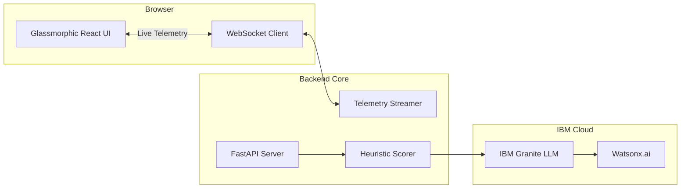

<div align="center">

# 🏎️ PitMind
### AI-Powered Race Strategy & Explainability Copilot
**Powered by IBM Granite & Watsonx.ai**

[](https://github.com/rohilG/pitMind/actions)
[](LICENSE)
[](https://www.python.org/)
[](https://react.dev/)

[Features](#-key-features) • [Quickstart](#-quickstart) • [Architecture](#-architecture) • [Documentation](./docs)

</div>

<br/>

> **PitMind** turns raw F1 telemetry into explainable pit-stop decisions, real-time strategy narrations, and fan-ready race commentary — all in one glassmorphic, data-rich interface.

---

## ✨ Key Features

<details>
<summary><b>🧠 Strategy Oracle (IBM Granite)</b></summary>
<br/>
Converts heuristic pit scoring into natural-language strategy narrations using IBM Granite (Watsonx.ai).
</details>

<details>
<summary><b>📊 Confidence Decomposition</b></summary>
<br/>
Breaks down AI confidence into 4 transparent, explainable dimensions (Data Quality, Model Certainty, Stability, Regret Bound) so race engineers never have to blindly trust a "black box."
</details>

<details>
<summary><b>💬 Copilot Chat</b></summary>
<br/>
Real-time race engineer Q&A grounded in live telemetry. Ask "Why did we pit early?" and get data-backed answers immediately.
</details>

<details>
<summary><b>🏎️ Fan Mode (`/fan`)</b></summary>
<br/>
Translates complex pit-wall data into plain-English AI commentary for non-technical fans, featuring live battle cards and intensity tracking.
</details>

<details>
<summary><b>🔴 Live WebSocket Telemetry</b></summary>
<br/>
High-performance React dashboard fed by a real-time WebSocket stream simulating live race states and track events.
</details>

---

## 🛠️ Technology Stack

<div align="center">
  <table>
    <tr>
      <td align="center" width="33%"><b>Frontend</b><br/>React 19 • Vite • TailwindCSS<br/>Glassmorphic UI</td>
      <td align="center" width="33%"><b>Backend</b><br/>FastAPI • Python 3.12<br/>WebSocket Streams</td>
      <td align="center" width="33%"><b>AI & Data</b><br/>IBM Granite (Watsonx.ai)<br/>Langflow • FastF1</td>
    </tr>
  </table>
</div>

---

## 🚀 Quickstart

Get PitMind running locally in seconds.

### 1. Clone & Configure
```bash
git clone https://github.com/rohilG/pitMind.git
cd pitMind
cp .env.example .env
```
*Edit `.env` to add your `WATSONX_API_KEY` and Firebase credentials.*

### 2. Run with Docker (Recommended)
```bash
docker compose up --build
```
> 🌐 **UI:** http://localhost:8080 | 🔌 **API:** http://localhost:8001/docs

### 3. Local Development (Alternative)
<details>
<summary><b>Backend Setup (FastAPI)</b></summary>

```bash
cd backend
python -m venv .venv
source .venv/bin/activate  # Windows: .venv\Scripts\activate
pip install -r requirements.txt
uvicorn main:app --reload --port 8000
```
</details>

<details>
<summary><b>Frontend Setup (Vite + React)</b></summary>

```bash
cd frontend
npm install
npm run dev
```
</details>

---

## 📐 Architecture Diagram



---

## 📖 Comprehensive Documentation

We have modernized all documentation. Explore the `docs/` directory for deep dives:

- 🚀 **[Quickstart Guide](./docs/QUICKSTART.md)** — Detailed setup instructions.
- 🔌 **[API Reference](./docs/API.md)** — REST & WebSocket endpoints.
- 🏗️ **[Architecture Details](./docs/architecture.md)** — System design and data flow.
- 🎨 **[F1 Styling Guide](./docs/F1_STYLING.md)** — UI tokens, fonts, and CSS architecture.
- 🚢 **[Deployment Guide](./docs/DEPLOYMENT.md)** — Moving PitMind to Production.

---

<div align="center">
  <p>Built for the speed of Formula 1. Engineered for absolute transparency.</p>
  <p><b>License:</b> Educational | <b>Version:</b> 1.0.0</p>
</div>
