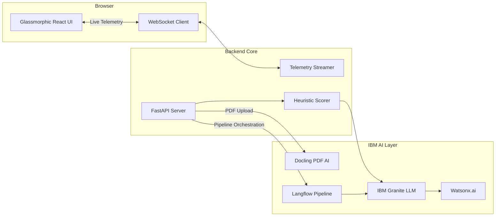

<div align="center">

# 🏎️ PitMind
### AI-Powered Race Strategy & Explainability Copilot
**Powered by IBM Granite & Watsonx.ai**

[](https://github.com/rohilG/pitMind/actions)
[](LICENSE)
[](https://www.python.org/)
[](https://react.dev/)
[](https://pitmind-frontend.2adms9tj6nke.eu-de.codeengine.appdomain.cloud)

[Live Demo](#-live-demo) • [Features](#-key-features) • [Quickstart](#-quickstart) • [Architecture](#-architecture) • [Documentation](./docs)

</div>

<br/>

> **PitMind** turns raw F1 telemetry into explainable pit-stop decisions, real-time strategy narrations, and fan-ready race commentary — all in one glassmorphic, data-rich interface.

---

## 🎯 Problem Statement

Formula 1 is one of the most **data-intensive sports on the planet**. During a single Grand Prix, a team's pit wall processes thousands of telemetry data points per second — tyre degradation curves, fuel loads, gap deltas, sector splits, weather forecasts, and competitor positioning — all feeding into split-second decisions that decide races.

Yet the tools available to race engineers are fragmented, opaque, and inaccessible:

- **Strategy calls are "black box"** — engineers see a recommendation but not *why* the AI reached that conclusion, eroding trust in critical moments.
- **Fan audiences are excluded** — the same data that drives pit-wall decisions is locked behind jargon and proprietary dashboards, leaving fans unable to understand the strategic chess match unfolding on track.
- **Post-race debriefs are manual** — teams spend hours converting raw PDFs and telemetry dumps into structured strategic insights.

**PitMind solves this** by building an AI-powered race strategy copilot that makes every decision *transparent, explainable, and accessible* — for engineers, strategists, and fans alike.

---

## 🔴 Live Demo

Experience PitMind running live on **IBM Cloud Code Engine**:

🚀 **[Launch PitMind Frontend Dashboard](https://pitmind-frontend.2adms9tj6nke.eu-de.codeengine.appdomain.cloud)**  
⚡ **[Explore PitMind Backend API (Swagger UI)](https://pitmind-backend.2adms9tj6nke.eu-de.codeengine.appdomain.cloud/docs)**  

### 📸 Project Walkthrough

<div align="center">
  <h4>Authentication Portal</h4>
  
</div>

<br/>

<div align="center">
  <h4>Live Engineer Dashboard</h4>
  
</div>

<br/>

<div align="center">
  <table>
    <tr>
      <td align="center">
        <b>⏳ Pre-Race Countdown</b><br/>
        
      </td>
      <td align="center">
        <b>🏁 Live Fan Mode</b><br/>
        
      </td>
    </tr>
    <tr>
      <td align="center">
        <b>🧠 Strategy Console</b><br/>
        
      </td>
      <td align="center">
        <b>📡 Raw Telemetry Stream</b><br/>
        
      </td>
    </tr>
  </table>
  <p><i>(Above: Exploring the Live Time Trace & AI Strategy Engine across dynamic UI modes)</i></p>
</div>

---

## ✨ Key Features

<details open>
<summary><b>🧠 Strategy Oracle (IBM Granite)</b></summary>
<br/>
Converts heuristic pit scoring into natural-language strategy narrations using IBM Granite (Watsonx.ai). Get split-second strategic recommendations based on tyre degradation, track temperature, and competitor pacing.
</details>

<details open>
<summary><b>📊 Confidence Decomposition</b></summary>
<br/>
Breaks down AI confidence into 4 transparent, explainable dimensions (Data Quality, Model Certainty, Stability, Regret Bound) so race engineers never have to blindly trust a "black box."
</details>

<details>
<summary><b>💬 Copilot Chat</b></summary>
<br/>
Real-time race engineer Q&A grounded in live telemetry. Ask "Why did we pit early?" and get data-backed answers immediately from the context-aware LLM.
</details>

<details>
<summary><b>🏎️ Fan Mode (`/fan`)</b></summary>
<br/>
Translates complex pit-wall data into plain-English AI commentary for non-technical fans, featuring live battle cards and intensity tracking.
</details>

<details>
<summary><b>🔴 Live WebSocket Telemetry</b></summary>
<br/>
High-performance React dashboard fed by a real-time WebSocket stream simulating live race states and track events with zero-latency updates.
</details>

---

## 🧠 IBM Technology Deep Dive

PitMind integrates **three IBM AI-supported technologies** as core components of the system:

### 1. IBM Granite via Watsonx.ai — Strategy Narration Engine

> **Role:** Core AI backbone — converts heuristic pit-stop scores into natural-language strategy explanations.

- **Model:** `ibm/granite-3-1-8b-instruct` via Watsonx.ai text generation API
- **How it's used:**
  - The heuristic engine computes raw strategy scores (pit urgency, safety car probability, overtake risk)
  - These scores are passed to Granite with structured prompts requesting JSON-schema-compliant responses
  - Granite generates explainable narrations with `recommendation`, `evidence`, `confidence`, `assumptions`, and `alternative` fields
  - A **Confidence Decomposition** system breaks AI output into 4 transparent dimensions (Data Quality, Model Certainty, Stability, Regret Bound)
- **Key design choice:** Granite *explains* pre-computed math rather than *inventing* strategy, ensuring accuracy while leveraging LLM strengths in natural language
- **Files:** [`services/granite.py`](./backend/services/granite.py) · [`services/pipeline.py`](./backend/services/pipeline.py) · [`services/strategy_engine.py`](./backend/services/strategy_engine.py)

### 2. Docling — PDF Document Intelligence

> **Role:** Transforms race PDF reports (FIA documents, team debriefs, strategy recaps) into structured Markdown for AI analysis.

- **How it's used:**
  - Users upload PDF files to the `/api/v1/debrief/upload` endpoint
  - Docling's `DocumentConverter` performs layout-aware parsing, preserving tables, figures, and document structure
  - The extracted Markdown is piped to Granite, which generates a 5-section post-race strategic debrief
  - Response includes **Docling provenance metadata**: page count, table count, figure count, and Docling version for full traceability
- **Files:** [`routes/commentary.py`](./backend/routes/commentary.py) (see `_try_docling_pdf()`)

### 3. Langflow — Visual Pipeline Orchestration

> **Role:** Optional visual pipeline layer for orchestrating multi-step AI workflows and external signal integration.

- **How it's used:**
  - The strategy pipeline calls Langflow's HTTP API (`/api/v1/run/{flow_id}`) as an optional orchestration step
  - When configured, Langflow can merge external signals (weather APIs, competitor feeds, historical data) into the strategy context before Granite narration
  - The pipeline gracefully degrades if Langflow is unconfigured — core strategy scoring continues without it
  - Configurable via environment variables: `LANGFLOW_API_URL`, `LANGFLOW_FLOW_ID`, `LANGFLOW_API_KEY`
- **Files:** [`services/langflow_client.py`](./backend/services/langflow_client.py) · [`services/pipeline.py`](./backend/services/pipeline.py)

---

## 🛠️ Technology Stack

<div align="center">
  <table>
    <tr>
      <td align="center" width="33%">
        
        <br/><b>Frontend</b><br/>React 19 • Vite • TailwindCSS<br/>Glassmorphic UI
      </td>
      <td align="center" width="33%">
        
        <br/><b>Backend</b><br/>FastAPI • Python 3.12<br/>WebSocket Streams
      </td>
      <td align="center" width="33%">
        
        <br/><b>AI & Data</b><br/>IBM Granite (Watsonx.ai)<br/>Docling • Langflow • FastF1
      </td>
    </tr>
  </table>
</div>

---

## 🚀 Quickstart

Get PitMind running locally in seconds.

### 1. Clone & Configure
```bash
git clone https://github.com/rohilG/pitMind.git
cd pitMind
cp .env.example .env
```
*Edit `.env` to add your `WATSONX_API_KEY` and Firebase credentials.*

### 2. Run with Docker (Recommended)
```bash
docker compose up --build
```
> 🌐 **UI:** http://localhost:8080 | 🔌 **API:** http://localhost:8001/docs

### 3. Local Development (Alternative)
<details>
<summary><b>Backend Setup (FastAPI)</b></summary>

```bash
cd backend
python -m venv .venv
source .venv/bin/activate  # Windows: .venv\Scripts\activate
pip install -r requirements.txt
uvicorn main:app --reload --port 8000
```
</details>

<details>
<summary><b>Frontend Setup (Vite + React)</b></summary>

```bash
cd frontend
npm install
npm run dev
```
</details>

---

## 📐 Architecture Diagram



---

## 🏁 Why This Matters

Car racing sits at the intersection of **human intuition and machine intelligence**. The fastest teams are the ones that can process enormous volumes of data and translate them into clear, actionable decisions in real time.

PitMind demonstrates how AI can transform the racing experience at every level:

| Stakeholder | Without PitMind | With PitMind |
|---|---|---|
| **Race Engineers** | Black-box strategy tools → guesswork under pressure | Transparent AI with confidence decomposition → informed, trust-backed decisions |
| **Team Strategists** | Manual PDF debriefs → hours of post-race analysis | Docling-powered instant debriefs → structured insights in seconds |
| **Fans** | Complex telemetry dashboards → excluded from strategy depth | AI-narrated Fan Mode → anyone can understand why a team pitted on lap 23 |

> **The core insight:** AI in racing isn't just about going faster — it's about making the *decision-making process* faster, more transparent, and more inclusive. PitMind brings that vision to life with IBM's open-source AI stack.

---

## 📖 Comprehensive Documentation

We have modernized all documentation. Explore the `docs/` directory for deep dives:

| Document | Description |
|----------|-------------|
| 🚀 **[Quickstart Guide](./docs/QUICKSTART.md)** | Detailed local and Docker setup instructions. |
| 🔌 **[API Reference](./docs/API.md)** | REST & WebSocket endpoints and schemas. |
| 🏗️ **[Architecture Details](./docs/architecture.md)** | System design, data flow, and component boundaries. |
| 🎨 **[F1 Styling Guide](./docs/F1_STYLING.md)** | UI tokens, fonts, and CSS architecture for the glassmorphic theme. |
| 🚢 **[Deployment Guide](./docs/DEPLOYMENT.md)** | Moving PitMind to Production on IBM Code Engine. |

---

<div align="center">
  
</div>

---

<div align="center">
  <p>Built for the speed of Formula 1. Engineered for absolute transparency.</p>
  <p><b>License:</b> Educational | <b>Version:</b> 1.0.0</p>
</div>

