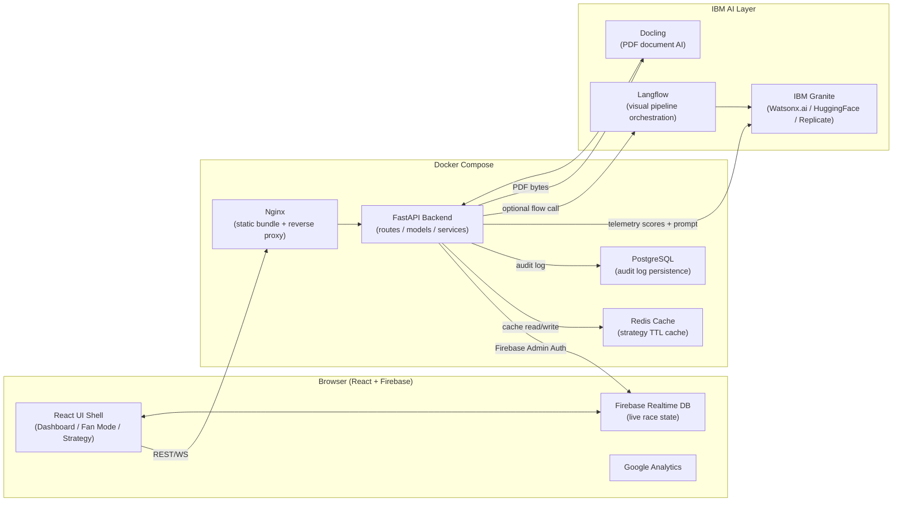

# PitMind — System Architecture

PitMind is a full-stack AI race strategy platform built for Formula 1-style environments. This document describes every layer of the system and how they connect.

---

## High-Level Architecture



---

## Component Breakdown

### Frontend (`frontend/`)

| Component | Purpose |
|---|---|
| `pages/Dashboard.tsx` | Engineer console — 3-column resizable/draggable layout |
| `pages/FanMode.tsx` | Public fan view — battle cards, standings, AI narratives |
| `pages/Strategy.tsx` | Strategic planning workspace |
| `pages/Telemetry.tsx` | Raw telemetry charting |
| `pages/Landing.tsx` | Marketing/hero page |
| `components/dashboard/StrategyTimeline.tsx` | Strategy reasoning trace + commit flow |
| `components/dashboard/ConfidenceDecompositionCard.tsx` | Explainability — breaks AI confidence into 4 dimensions |
| `components/dashboard/PostRaceDebrief.tsx` | PDF upload → Docling parse → Granite debrief |
| `components/dashboard/LiveSystemFeed.tsx` | Real-time race control messages via WebSocket |
| `components/dashboard/DecisionLog.tsx` | Annotatable strategy decision audit trail |
| `components/dashboard/StreamHealthMonitor.tsx` | WebSocket health + latency |
| `hooks/useFirebaseRaceState.ts` | Firebase Realtime DB subscription for live race state |
| `hooks/useTelemetry.ts` | Local telemetry state management |
| `services/api.ts` | Type-safe REST API client |
| `contexts/RoleContext.tsx` | Engineer / Strategist / Commentator role switching |

### Backend (`backend/`)

| Module | Purpose |
|---|---|
| `main.py` | FastAPI app — CORS, middleware, WebSocket streaming, health |
| `routes/strategy.py` | `/api/v1/strategy/*` — recommend, commit, audit, cache |
| `routes/commentary.py` | `/api/v1/chat/*`, `/api/v1/debrief/upload` — Granite chat + Docling debrief |
| `routes/fan.py` | `/api/v1/fan/*` — fan predictions, status |
| `routes/auth.py` | Firebase ID token verification |
| `services/granite.py` | IBM Granite client — parallel Watsonx / HuggingFace / Replicate providers with cache |
| `services/langflow_client.py` | Optional Langflow HTTP flow runner |
| `services/pipeline.py` | Orchestrator — telemetry → Langflow → Granite → StrategyRecommendation |
| `services/strategy_engine.py` | Heuristic pit urgency / compound / undercut scoring |
| `services/sanitize.py` | Upload validation, CSV/JSON parsing, byte-cap enforcement |
| `services/fastf1_service.py` | FastF1 session telemetry fetcher |
| `services/cache_manager.py` | Redis + in-memory fallback caching with TTL |
| `services/cache_invalidator.py` | Event-driven cache invalidation (safety car, pit stop, etc.) |
| `models/strategy.py` | Pydantic models — StrategyRecommendation, ConfidenceDecomposition |
| `models/race_state.py` | TelemetryPayload, LapPoint |
| `models/audit_log.py` | SQLAlchemy AuditLog ORM model |

---

## IBM AI Pipeline (detailed)

```
Telemetry JSON ──┐
                 ├─► Sanitize/Normalize ──► Heuristic Scorer ──┐
PDF Upload ──► Docling Parser ──────────────────────────────────┤
                                                                 ├─► Context Merger
                                                                 │
                                                          ┌──────┘
                                                          │
                                                   Prompt Builder
                                                          │
                                               IBM Granite (Watsonx.ai)
                                                          │
                              ┌───────────────────────────┼───────────────────┐
                              │                           │                   │
                    Confidence Decomposer          Fan Narrative          Audit Log
                     (data_quality,                  Adapter             (PostgreSQL)
                      model_certainty,
                      stability,
                      regret_bound)
                              │
                    StrategyRecommendation
                    (JSON response to UI)
```

### IBM Tool Usage

| Tool | How Used | Where |
|---|---|---|
| **IBM Granite** | Strategy narration, chat Q&A, debrief generation, driver comparison summaries | `services/granite.py` — supports Watsonx, HuggingFace Inference API, Replicate |
| **Langflow** | Visual pipeline orchestration — 10-stage flow from telemetry to structured output | `langflow-flows/pitmind_strategy_pipeline.json`, `services/langflow_client.py` |
| **Docling** | PDF race report parsing — extracts tables, figures, section headings into markdown | `routes/commentary.py → _try_docling_pdf()` |

---

## Data Flow — Strategy Recommendation

```
1. Frontend POSTs TelemetryPayload to /api/v1/strategy/recommend
2. FastAPI authenticates via Firebase ID token
3. pipeline.run_strategy_pipeline():
   a. Calls langflow_client.run_strategy_flow() [optional, if LANGFLOW_API_URL set]
   b. Calls strategy_engine.build_recommendation() — heuristic scores
   c. Assembles Granite prompt with scores + Langflow signals
   d. Calls granite.granite_generate() — parallel Watsonx/HuggingFace/Replicate
   e. Merges Granite JSON into StrategyRecommendation
   f. Computes ConfidenceDecomposition
4. Saves AuditLog to PostgreSQL
5. Returns StrategyRecommendation JSON to UI
6. UI renders: Strategy Oracle card, Confidence chart, Evidence drill-down
```

## Data Flow — Post-Race Debrief (Docling)

```
1. User uploads PDF to /api/v1/debrief/upload
2. _try_docling_pdf(raw) called:
   a. DocumentConverter().convert(path) — Docling layout analysis
   b. doc.export_to_markdown() — structure-preserving extraction
   c. Counts: pages, tables, figures
   d. Returns (markdown_text, metadata)
3. pipeline.debrief_from_text(markdown_text) called:
   a. Granite system prompt: Senior Chief Race Strategist role
   b. Generates 5-section debrief: Pace, Tyres, Strategy Calls, Risk, Forward Actions
4. DebriefResponse returned with source_note showing Docling provenance
```

---

## WebSocket Telemetry Streaming

```
Browser ──WS──► /api/v1/stream/telemetry?session_id=current_race
                        │
                ConnectionManager (session registry)
                        │
                ┌───────┴───────┐
                │               │
          receive_handler   broadcast_handler
          (ping/pong)       (1Hz telemetry tick)
                │               │
             client          Redis (connection tracking)
```

---

## Infrastructure

| Service | Port | Purpose |
|---|---|---|
| Nginx | 8080 | Static bundle serving + `/api` proxy |
| FastAPI | 8001 | REST API + WebSocket |
| Redis | 6379 | Strategy response cache (TTL-based) |
| PostgreSQL | 5432 | Audit log, strategy commits |
| Firebase | Cloud | Auth + Realtime DB for live race state |
