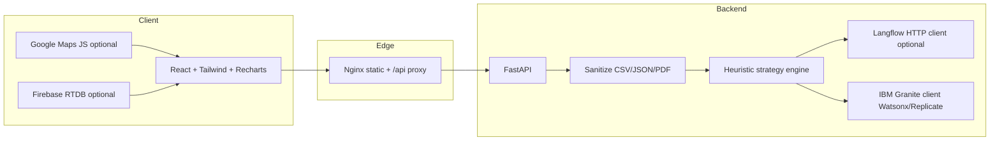

# PitMind architecture

Telemetry uploads land on FastAPI where pandas-backed parsers normalize columns. The scoring layer produces structured scores PitMind surfaces in cards while Granite narrates the rationale. Langflow remains the visual orchestration surface: export JSON lives under `langflow-flows/` and HTTP runners can call the same preprocessing/scoring functions if lifted into Langflow Python components.
